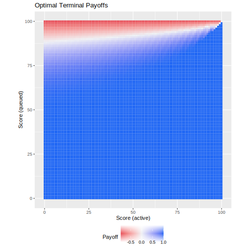
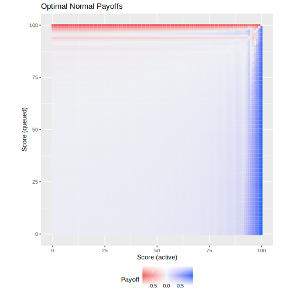
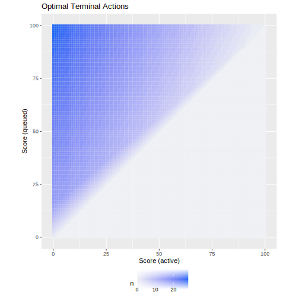
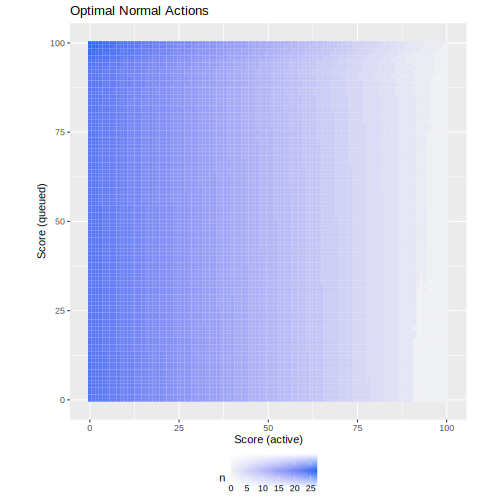

# Greed—Optimal Policy Solver

## Background

Greed is a dice-based two-player game where players try to get as close to the maximum score as possible without going bust. The player whose score is higher at the end of play wins. This project implements a dynamic programming solution to determine the optimal policy for any game state.

## Game Rules

In this game, players alternate turns, each choosing to roll as many dice as they like. Each die is numbered from 1 to n, typically 6. The total rolled on a turn is added to that player’s score. However, if a player’s score ever exceeds the maximum threshold, typically 100, they bust and immediately lose the game.

Play continues back and forth until one player decides to roll 0 dice, signaling the beginning of the last round. The opposing player then has one final opportunity to roll, following the same rules. Once this last turn is completed, the game ends. The player with the higher score wins; if both players have the same score, the game is declared a draw.

## Project Structure

- `/code`: Contains the code to either:
  - calculate the optimal policy and visualize it; or
  - play a game of Greed.
- `/paper`: Documents the mathematical theory and algorithms used.

## Usage

### Playing

```sh
cd code

# play a game of greed with player 1 = Alice, player 2 = Blair
cargo run --release -- play --max 100 --sides 6 Alice Blair
```

```
 ██████╗ ██████╗ ███████╗███████╗██████╗
██╔════╝ ██╔══██╗██╔════╝██╔════╝██╔══██╗
██║  ███╗██████╔╝█████╗  █████╗  ██║  ██║
██║   ██║██╔══██╗██╔══╝  ██╔══╝  ██║  ██║
╚██████╔╝██║  ██║███████╗███████╗██████╔╝
 ╚═════╝ ╚═╝  ╚═╝╚══════╝╚══════╝╚═════╝
        max score: 100, sides: 6

round 0: Alice: 0, Blair: 0, last: false
Alice rolls: 25

round 1: Blair: 0, Alice: 74, last: false
Blair rolls: 25

round 2: Alice: 74, Blair: 89, last: false
Alice rolls: 5

round 3: Blair: 89, Alice: 90, last: false
Blair rolls: 2

round 4: Alice: 90, Blair: 95, last: false
Alice rolls: 3

round 5: Blair: 95, Alice: 100, last: false
Blair rolls: 2

=========================================
              final results
=========================================
Alice: 100, Blair: 104
Alice wins!
```

### Solving & Visualizing

```sh
cd code

# generates a (mostly) human readable report
cargo run --release -- solve --max 100 --sides 6 --format stdout

# generates csv file `visualize/greed_[max]_[sides].csv`
cargo run --release -- solve --max 100 --sides 6 --format csv

# generates svg files [default]
# - `terminal_n.svg`
# - `terminal_payoffs.svg`
# - `normal_n.svg`
# - `normal_payoffs.svg`
cargo run --release -- solve --max 100 --sides 6 --format svg
```

| | **Terminal** | **Normal** |
|-|--------------|------------|
| **Payoff** |  |  |
| **n** |  |  |


## Key Findings

- **The first player has a slight advantage**: The first player has a slight advantage at the start of the game, but luck will subsume any advantage that they may initially have.
- **Stopping early is risky**: Even when ahead, halting before reaching ~80–90 points gives the opponent a significant chance to catch up in a single roll.
